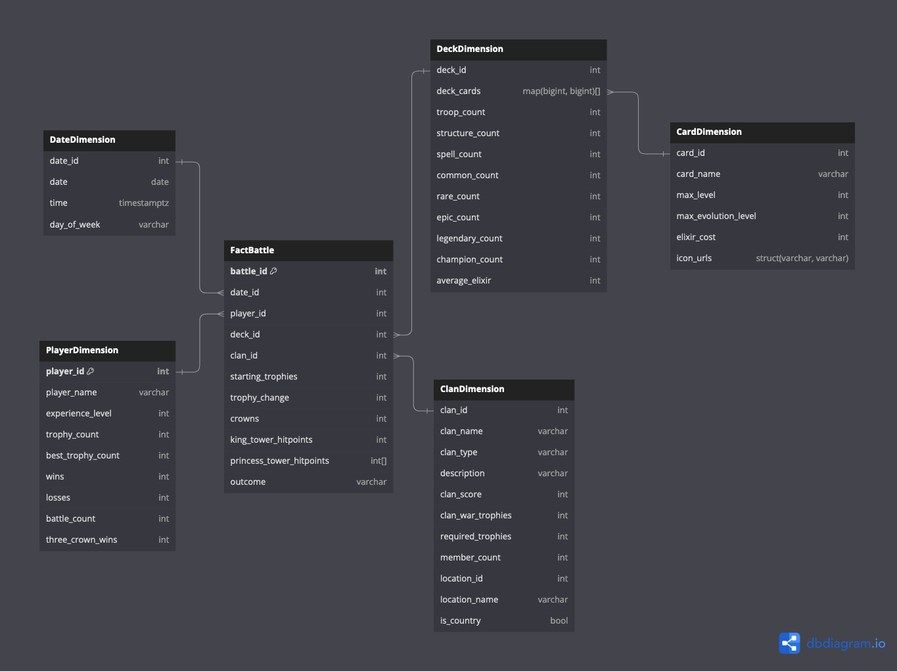
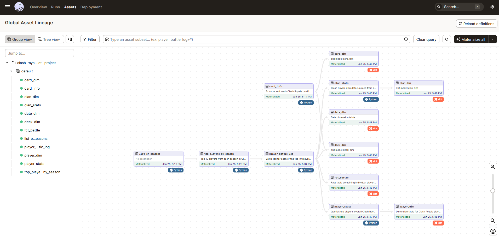

# Clash Royale - ETL and Data Warehousing for Analytics Project

## Background Information

Clash Royale is a mobile game that I have been playing for over a year now. It is a real-time strategy game where players build decks of cards representing troops, spells, and defenses and battle against opponents in fast-paced, head-to-head duels. The goal is to destroy your opponent's towers while defending your own using strategic placement, timing, and resource management. As you win battles and progress, you unlock new cards, upgrade existing ones, and climb through different arenas.

One of the main aspects of the game is how you choose to build your "battle deck". Each battle deck contains eight cards and the idea is to use cards that work well with each other. With over 100 cards available in the game, there are many different deck combinations one can choose to use. As I have progressed into higher levels, I noticed people employing different strategies in how they build their decks. Some people use all of the cheapest cards in the game, some focus solely on defense, and others will use only troops that fly.

## Project Goals

The goal of this project is to use data engineering and analytics to find winning deck combinations in Clash Royale. I have built a data pipeline that involves extraction, loading, and transformation (ELT) of Clash Royale data into an analysis-friendly data warehouse. A reporting dashboard will also be built on top of the data warehouse.

## Data Source

The data is sourced from the official [Clash Royale API](https://developer.clashroyale.com/#/) and [Royale GitHub API](https://royaleapi.github.io/cr-api-data/). With millions of players worldwide, I started by first determining a set of players whose data I would ingest into the warehouse. I did this by querying the API for the top 10 players in each "season" of Clash Royale, which is for the duration of a month. The earliest season that there is data available for is Feburary 2016, so the warehouse contains data for the top 10 players in each season since then.

## Tools/Technologies

In the interest of keeping costs to a minimum, I opted for open-source tools. The data extraction and loading is written in Python. For my data warehouse I am using [MotherDuck](https://motherduck.com/), a cloud-hosted DuckDB platform. For data transformations, I am using [dbt](https://www.getdbt.com/). Finally, I am using [Dagster](https://dagster.io/) to orchestrate everything. So far, I find that these tools all integrate very well with each other and are super fun to use.

## Data Model

The Kimball data model I designed for my warehouse is as follows: 
- a fact table for player versus player battles
    - the granularity of the fact table is a battle for **one** player, so there will be at least 2 rows for a given battle
- a dimension for players and their personal stats
- a dimension for date
- a dimension for deck (an unordered combination of eight cards)
- a snowflaked dimension for cards, for storing statistics for individual cards
- and a dimension for clans (a group of players)

## ETL Orchestration

The screenshot below depicts the DAG that I have written in the Dagster framework to schedule the ETL process of querying data from the APIs, writing them to staging tables in the warehouse, and finally generating the final data model in the warehouse using dbt.

