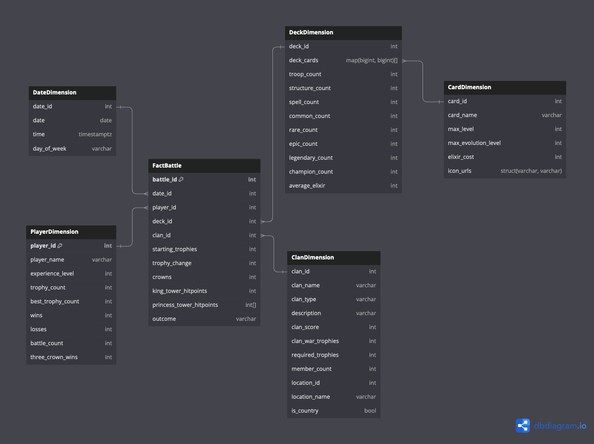
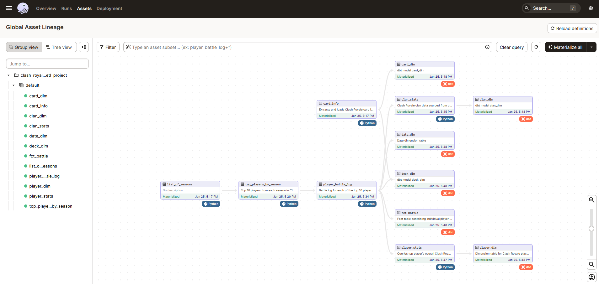

# Clash Royale - ETL and Data Warehousing for Analytics Project

### Table of Contents
* [Background Information](https://github.com/flemm0/clash_royale#background-information)
* [Data Source](https://github.com/flemm0/clash_royale#data-source)
* [Tools and Technologies](https://github.com/flemm0/clash_royale#data-source)
* [Data Model Design](https://github.com/flemm0/clash_royale#data-model)
* [ETL (ELT) Orchestration](https://github.com/flemm0/clash_royale#elt-orchestration)
* [Analytics App](https://github.com/flemm0/clash_royale#analytics-app)
* [Database Sharing](https://github.com/flemm0/clash_royale#database-sharing)

## Background Information

Clash Royale is a mobile game that I have been playing for over a year now. It is a real-time strategy game where players build decks of cards representing troops, spells, and defenses and battle against opponents in fast-paced, head-to-head duels. The goal is to destroy your opponent's towers while defending your own using strategic placement, timing, and resource management. As you win battles and progress, you unlock new cards, upgrade existing ones, and climb through different arenas.

One of the main aspects of the game is how you choose to build your "battle deck". Each battle deck contains eight cards and the idea is to use cards that work well with each other. With over 100 cards available in the game, there are many different deck combinations one can choose to use. As I have progressed into higher levels, I noticed people employing different strategies in how they build their decks. Some people use all of the cheapest cards in the game, some focus solely on defense, and others will use only troops that fly.

The goal of this project is to use data engineering techniques such as ELT and data modeling to design an analytics-friendly data warehouse that can enable gameplay insights. To showcase the utility of the warehouse, a reporting dashboard will also be built as the final layer.

## Data Source

The data is sourced from the official [Clash Royale API](https://developer.clashroyale.com/#/) and [Royale GitHub API](https://royaleapi.github.io/cr-api-data/). With millions of players worldwide, I started by first determining a set of players whose data I would ingest into the warehouse. I did this by querying the API for the top 10 players in each "season" of Clash Royale, with each season corresponding to a month. The earliest season that there is data available for is Feburary 2016, so the warehouse contains data for the top 10 players in each season since then.

## Tools/Technologies

In the interest of keeping costs to a minimum, I opted for open-source tools. The data extraction and loading is written in Python. For my data warehouse I am using [MotherDuck](https://motherduck.com/), a cloud-hosted DuckDB platform. For data transformations, I am using [dbt](https://www.getdbt.com/). Finally, I am using [Dagster](https://dagster.io/) to orchestrate everything in the ELT process. The logic for the orchestration can be mostly found [here](https://github.com/flemm0/clash_royale/tree/main/dagster/clash_royale_etl_project). For hosting the orchestration process, I am using a small instance of an Azure Linux VM, which will allow for my scheduled jobs (such as updating the fact table daily) to run.

## Data Model

The Kimball data model I designed for my warehouse is as follows: 
- a fact table for player versus player battles
    - the granularity of the fact table is a battle for **one** player, so there will be at least 2 rows for a given battle
- a dimension for players and their personal stats
- a dimension for date
- a dimension for deck (an unordered combination of eight cards)
- a snowflaked dimension for cards, for storing statistics for individual cards
- and a dimension for clans (a group of players)

The code for the dbt models files used to generate these tables can be found [here](https://github.com/flemm0/clash_royale/tree/main/dbt/clash_royale/models/warehouse)



## ELT Orchestration

The screenshot below depicts the DAG that I have written in the Dagster framework to schedule the ETL process of querying data from the APIs, writing them to staging tables in the warehouse, and finally generating the final data model in the warehouse using dbt.



## Analytics App

This project wouldn't be an end-to-end analytics engineering project without an analytics dashboard that shows what insights can be derived from the data warehouse. I have developed a quick dashboard using the [Streamlit](https://streamlit.io/) library in Python and hosted it on Streamlit Community Cloud for anyone to view. Click [here](https://clashroyale.streamlit.app/) to view the app. (Once you have navigated to the app's url I suggest clicking on the three buttons on the top right corner, clicking on "settings" and then turning on wide mode for a better viewing experience.) Additionally, I developed a quick dashboard using Power BI, click [here](https://github.com/flemm0/clash_royale/blob/main/clash_royale_dashboard.pbix) to download.

## Database Sharing

A cool feature of DuckDB/MotherDuck is the ability to easily share databases. I have provided a snapshot of the data warehouse as of January 25, 2024 for users to import and query the data warehouse that I have created. All related files are stored in the `clash_royale_data_warehouse` directory of this repository.

**The following instructions detail how to load the data warehouse on your local machine:**

Assuming DuckDB and git is installed on your system, first clone the repository:
```bash
git clone git@github.com:flemm0/clash_royale.git

cd clash_royale
```
Then open up DuckDB in the same directory
```bash
duckdb
```
Import database from the .sql and parquet files with one command:
```
D IMPORT DATABASE 'clash_royale_data_warehouse';
```
Voila!
```
D SHOW TABLES;
┌────────────┐
│    name    │
│  varchar   │
├────────────┤
│ card_dim   │
│ clan_dim   │
│ date_dim   │
│ deck_dim   │
│ fct_battle │
│ player_dim │
└────────────┘
```
The staging and raw schemas are accessible as well:
```
D SHOW ALL TABLES;
┌──────────┬─────────┬──────────────────────┬──────────────────────┬───────────────────────────────────────────────────────────┬───────────┐
│ database │ schema  │         name         │     column_names     │                       column_types                        │ temporary │
│ varchar  │ varchar │       varchar        │      varchar[]       │                         varchar[]                         │  boolean  │
├──────────┼─────────┼──────────────────────┼──────────────────────┼───────────────────────────────────────────────────────────┼───────────┤
│ memory   │ main    │ card_dim             │ [card_name, card_i…  │ [VARCHAR, BIGINT, BIGINT, VARCHAR, VARCHAR, BIGINT, VAR…  │ false     │
│ memory   │ main    │ clan_dim             │ [clan_id, clan_tag…  │ [UBIGINT, VARCHAR, VARCHAR, VARCHAR, VARCHAR, INTEGER, …  │ false     │
│ memory   │ main    │ date_dim             │ [date_id, battle_d…  │ [VARCHAR, DATE, BIGINT, BIGINT, VARCHAR, BIGINT, VARCHA…  │ false     │
│ memory   │ main    │ deck_dim             │ [deck_id, cards_li…  │ [UBIGINT, VARCHAR[], BIGINT, BIGINT, BIGINT, BIGINT, BI…  │ false     │
│ memory   │ main    │ fct_battle           │ [battle_id, date_i…  │ [VARCHAR, VARCHAR, UBIGINT, UBIGINT, UBIGINT, VARCHAR, …  │ false     │
│ memory   │ main    │ player_dim           │ [player_id, player…  │ [UBIGINT, VARCHAR, VARCHAR, INTEGER, INTEGER, INTEGER, …  │ false     │
│ memory   │ raw     │ player_battle_log    │ [type, battleTime,…  │ [VARCHAR, VARCHAR, BOOLEAN, BIGINT, VARCHAR, BIGINT, VA…  │ false     │
│ memory   │ staging │ stg_cards            │ [key, name, sc_key…  │ [VARCHAR, VARCHAR, VARCHAR, BIGINT, VARCHAR, VARCHAR, B…  │ false     │
│ memory   │ staging │ stg_clan_stats       │ [tag, name, type, …  │ [VARCHAR, VARCHAR, VARCHAR, VARCHAR, INTEGER, INTEGER, …  │ false     │
│ memory   │ staging │ stg_player_stats     │ [tag, name, expLev…  │ [VARCHAR, VARCHAR, INTEGER, INTEGER, INTEGER, INTEGER, …  │ false     │
│ memory   │ staging │ stg_seasons          │ [id, query_url]      │ [VARCHAR, VARCHAR]                                        │ false     │
│ memory   │ staging │ stg_top_players_by…  │ [tag, name, expLev…  │ [VARCHAR, VARCHAR, BIGINT, BIGINT, BIGINT, STRUCT(tag V…  │ false     │
├──────────┴─────────┴──────────────────────┴──────────────────────┴───────────────────────────────────────────────────────────┴───────────┤
│ 12 rows                                                                                                                        6 columns │
└──────────────────────────────────────────────────────────────────────────────────────────────────────────────────────────────────────────┘
```
