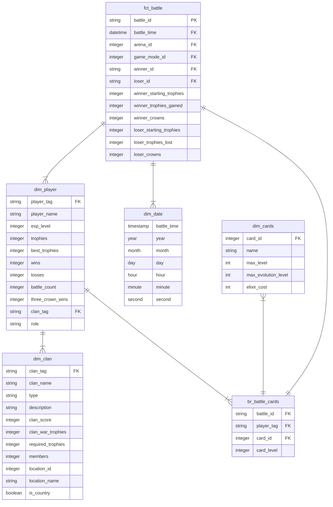

# Clash Royale - ETL and Data Warehousing for Analytics Project

## Background Information

Clash Royale is a mobile game that I have been playing for over a year now. It is a real-time strategy game where players build decks of cards representing troops, spells, and defenses and battle against opponents in fast-paced, head-to-head duels. The goal is to destroy your opponent's towers while defending your own using strategic placement, timing, and resource management. As you win battles and progress, you unlock new cards, upgrade existing ones, and climb through different arenas.

One of the main aspects of the game is how you choose to build your "battle deck". Each battle deck contains eight cards and the idea is to use cards that work well with each other. With over 100 cards available in the game, there are many different deck combinations one can choose to use. As I have progressed into higher levels, I noticed people employing different strategies in how they build their decks. Some people use all of the cheapest cards in the game, some focus solely on defense, and others will use only troops that fly.

## Project Goals

The goal of this project is to use data engineering and analytics to find winning deck combinations in Clash Royale. I have built a data pipeline that involves extraction, loading, and transformation (ELT) of Clash Royale data into an analysis-friendly data warehouse. A reporting dashboard will also be built on top of the data warehouse.

The data is sourced from [Kaggle](https://www.kaggle.com/datasets/bwandowando/clash-royale-season-18-dec-0320-dataset) as well as the official [Clash Royale API](https://developer.clashroyale.com/#/). The Kaggle data was sourced due to API changes that made it difficult to ingest player vs. player data directly from the API. For example, if querying information on users, the API requires the request to specify the unique user id to return data for, therefore requiring a call for every single user. This make gathering information on millions of users rather challenging without having a continuously running job on a cloud compute platform. Regardless, the data hosted on Kaggle is of decent size (>20 GB) to get me started on data management concepts, and I have plans to migrate this code into the cloud in the near future.

## Tools/Technologies

In the interest of keeping costs to a minimum, I opted for open-source tools. The data extraction and loading is written in Python. For my data warehouse I am using [MotherDuck](https://motherduck.com/), a cloud-hosted DuckDB platform. For data transformations, I am using [dbt](https://www.getdbt.com/). Finally, I am using [Dagster](https://dagster.io/) to orchestrate everything. So far, I find that these tools all integrate very well with each other and are super fun to use.

## Data Model

The Kimball data model I designed for my warehouse is as follows: 
- a fact table for player versus player battles
- a dimension for players
- a dimension for date
- a bridge table for battle cards (storing who used what cards in which battle)
- a dimension for cards
- and a dimension for clans (a group of players)
